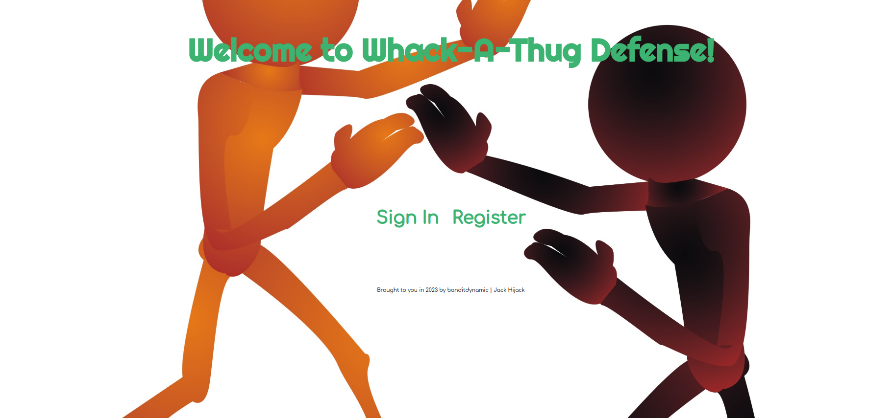
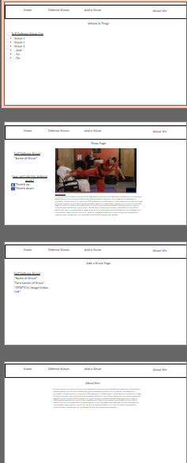

# Whack-A-Thug Self Defense

I did this because, at the end of the day, I firmly believe in helping others who need help: in this case, self defense. I've spent many years training to fight, and defend myself, in almost every environment.  I actually dislike fighting, but I do enjoy surviving a change encounter and living afteward.

There's humor in this project, but at its core is my desire to help people overcome environmental challenges that are prevelant in every-day life.

Technologies used were: HTML 5, CSS, JS ES6 (Vanilla), NoSQL (MongoDB, Mongoose) Express and EJS. This was also my first attempt to dynamically embed internet videos on command: sort of my attempt at a poor man's API.

## Project Choice: 
Whack-A-Thug Self Defense: a self-defense inspired webapp/site

## Project Description:
This site provides users with videos to assist them in defending themselves against would-be attackers, in a variety of environments and scenarios. Users can rate and comment on each video, based on how well the defense worked or didn't work.

## Wire Frames:

### MVP Goals:
A fully functioning basic CRUD app
list of moves
show page with descriptions for context
add, edit, and delete moves

### Stretch Goals:
Add a rating system (did this move work?(yes/no; stars, box click, etc))
embed images or (SUPER STRECH) video links to each move
add styling using bootstrap or something similar

